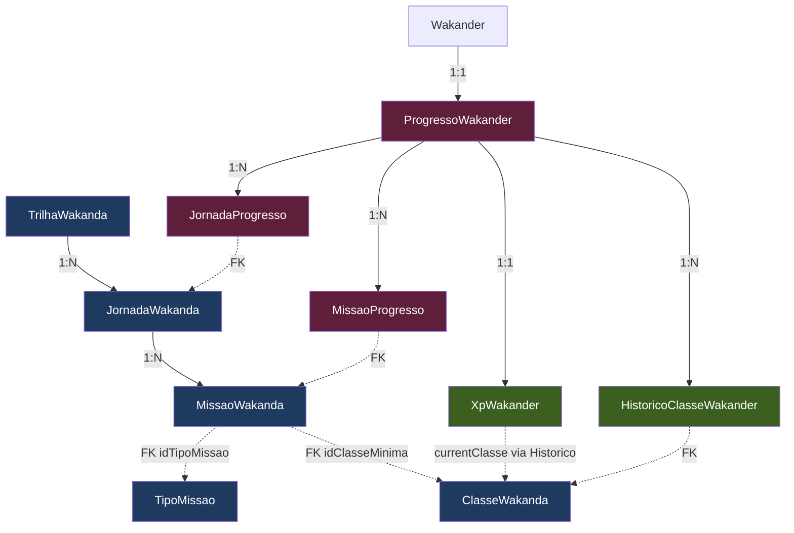
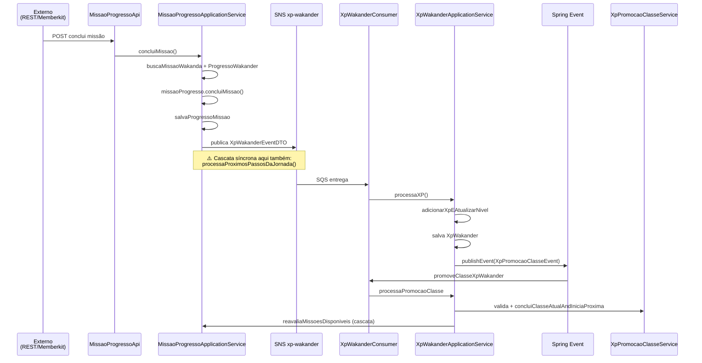

# Arquitetura de Gamificação — WakandaAI

> Análise técnica profunda do domínio de gamificação no contexto end-to-end do sistema.
> **Objetivo**: avaliar saúde técnica + preparar adição segura de novas features de missão.

---

## 1. Sumário Executivo

| Dimensão | Nota | Veredito curto |
|----------|:---:|---|
| Separação de pacotes (Catálogo/Progresso/XP) | **8/10** | Clara e lógica, intenção comunicada pelo nome |
| Hexagonal — Ports & Adapters | **9/10** | Padrão duplo de Repository consistente, zero JPA vazando |
| Domínio rico vs anêmico | **7/10** | Misto — `MissaoWakanda`, `XpWakander`, `OrdemMissao` ricos; `TipoMissao` e `ProgressoWakander` anêmicos |
| Agregados DDD | **6/10** | Sem associações JPA; navegação por ID. Root aggregate ambíguo em Progresso |
| SRP em ApplicationServices | **8/10** | Bem segmentado por contexto |
| DIP | **9/10** | Dependências apontam para interfaces; sem `@Entity` em application |
| OCP — Processadores (Strategy) | **9/10** | 5 chains de processadores, extensão trivial via `@Component` |
| OCP — TipoMissao | **3/10** | **Crítico**: tabela-como-enum, comportamento por tipo exige `if/switch` |
| Eventos de domínio | **4/10** | Publicados em services, não no domínio. Mistura SQS + Spring Events |
| Anti-Corruption Layer | **5/10** | Z-API e Discord vazam DTOs; MemberKit e Asaas bem encapsulados |
| Idempotência | **⚠️** | Dedup por `UUID.randomUUID()` funcional, mas reconsumo SQS pode duplicar `MissaoProgresso` |
| Observabilidade | **⚠️** | Logs OK, sem distributed tracing |

**Veredito global:** Arquitetura **production-ready** com aplicação consistente de SOLID + Hexagonal. **Bem preparada para adicionar novos processadores e classes**, mas **frágil para adicionar comportamento polimórfico por TipoMissao**.

---

## 2. Modelo Conceitual

### Organização em 3 sub-contextos

```
gameficacao/
├── catalogo/         ← Imutável: "o que é possível fazer"
│   ├── trilhawakanda/    (Trilha = sequência de jornadas)
│   ├── jornadawakanda/   (Jornada = agrupamento de missões)
│   ├── missaowakanda/    (Missão = unidade gamificada)
│   ├── tipomissao/       (Tipo = lookup table)
│   └── memberkit/        (Integração com LMS)
│
├── progresso/        ← Dinâmico: "o que o Wakander já fez"
│   ├── progressowakander/   (ROOT? — wakander tem 1 progresso)
│   ├── jornadaprogresso/    (Status de jornada por wakander)
│   └── missaoprogresso/     (Status de missão por wakander)
│
└── xp/               ← Derivado: "estado de gamificação atual"
    ├── xpwakander/          (XP total + nível + sabedorias)
    ├── classewakanda/       (Classe = rank do wakander)
    └── historicoclasse/     (Auditoria de promoções)
```

### Diagrama de relacionamentos lógicos



> **Observação**: relacionamentos são **lógicos** (Foreign Key Objects via UUID), não associações JPA. Isso reduz acoplamento de carga mas exige busca explícita em cada coordenação.

---

## 3. Camada Domain — Análise Crítica

### 3.1 Entidades Ricas (✅ bons exemplos)

#### `MissaoWakanda` — domínio rico com invariantes protegidos
**Path:** `src/main/java/academy/wakanda/wakanda_ai/gameficacao/catalogo/missaowakanda/domain/MissaoWakanda.java`

- **Construtor com validação**: `validaXPBase()` (XP > 0) e `validaSabedorias()` (pelo menos 1 sabedoria)
- **15+ métodos comportamentais**: `desativaMissao()`, `alteraXpBase()`, `atualizaMissaoComDadosIA()`, `estaAtiva()`, `possuiClasseMinimaDefinida()`
- **Value Objects embarcados**: `OrdemMissao`, `Sabedorias`
- **Status enums com semântica**: `MissaoStatus`, `ProcessamentoStatus`

#### `XpWakander` — lógica de cálculo Fibonacci no domínio
**Path:** `src/main/java/academy/wakanda/wakanda_ai/gameficacao/xp/xpwakander/domain/XpWakander.java`

```java
public void adicionarXpEAtualizarNivel(Integer xpObtido, Sabedorias sabedorias) {
    adicionaXp(xpObtido);
    atualizaNivel();              // loop while(podeSubirDeNivel())
    atualizaSabedoriasDoWakander(sabedorias);
}

private boolean podeSubirDeNivel() {
    return xpTotal >= xpProximoNivel;
}
```

✅ Lógica de gamificação está onde deveria estar (no domínio, não no service).

#### `OrdemMissao` — value object inteligente
- Factory `criar(int)` com validação `ordem >= 0`
- Métodos estáticos para reordenação: `validarNovaPosicao()`, `ajustarPosicoesIntermediarias()`

### 3.2 Entidades Anêmicas (⚠️ atenção)

| Entidade | Problema |
|----------|----------|
| `TipoMissao` | Só getter — é um enum disfarçado em tabela. Sem comportamento polimórfico |
| `ProgressoWakander` | Apenas construtor — toda lógica vive em services |
| `MissaoProgresso` | Tem método `concluiMissao(xpBase, sabedorias)` mas **recebe** dados em vez de pedir (Tell-don't-Ask invertido) |

#### Exemplo do problema com `MissaoProgresso.concluiMissao`
```java
public void concluiMissao(Integer xpBase, Sabedorias sabedorias) {
    // ❌ xpBase e sabedorias vêm de FORA — quem chama precisa buscar MissaoWakanda primeiro
    this.xpObtido = xpBase;
    this.sabedorias = SabedoriasMissaoProgresso.fromCatalogo(sabedorias);
}
```

Service precisa orquestrar busca explícita:
```java
// Em MissaoProgressoApplicationService
MissaoWakanda missao = missaoWakandaRepository.buscaMissaoPorId(...);
missaoProgresso.concluiMissao(missao.getXpBase(), missao.getSabedorias());
```

**Trade-off**: bom para JPA (sem `@ManyToOne` eager), ruim para coesão (lógica de "concluir missão considerando regras da missão" vive no service).

### 3.3 Fugas Técnicas (⚠️)

#### Bean Validation no domínio
**Path:** `MissaoWakanda.java:8-9`
```java
import jakarta.validation.constraints.NotBlank;
import jakarta.validation.constraints.NotNull;
```
Validação de framework dentro do domínio. **Invariantes deveriam ser garantidos por código de domínio puro** (já existe `validaXPBase()`), não por anotação de framework.

#### Anotações JPA inevitáveis
`@Entity`, `@Table`, `@Column` estão presentes — aceitável para Spring Boot. Sem `@OneToMany`/`@ManyToOne` significa que **agregação é por ID**, não por navegação.

### 3.4 Invariantes — onde estão protegidos?

| Entidade | Invariante | Proteção |
|----------|-----------|----------|
| `MissaoWakanda` | `xpBase > 0`, sabedorias não vazias | ✅ `validaXPBase()`, `validaSabedorias()` no construtor |
| `OrdemMissao` | `ordem >= 0` | ✅ `criar(int)` factory |
| `XpWakander` | `nivelAtual` monotônico, `xpTotal >= 0` | ✅ encapsulado em `subirNivel()` |
| `ClasseWakanda` | `nivelNecessario > 0` | ⚠️ Validado no construtor, **mas `atualizaParcialmente()` permite sobrescrever sem revalidar todos os campos** |
| `ProgressoWakander` | `idWakander != null` | ❌ Sem validação |
| `MissaoProgresso` | `tentativas >= 0` | ❌ Sem controle |
| `JornadaWakanda` | `xpBonus > 0` | ❌ Sem validação |

---

## 4. Camada Application — Análise Crítica

### 4.1 ApplicationServices — orquestradores principais

| Service | Responsabilidade | Dependências |
|---------|-----------------|--------------|
| `MissaoProgressoApplicationService` | Concluir missão + liberar próxima | 8 (4 ports + 1 publisher + 2 services + 1 config) |
| `XpWakanderApplicationService` | Processar XP + promover classe | 7 (4 ports + EventPublisher + 1 service + 1 helper) |
| `ProgressoWakanderApplicationService` | Dispatch via Strategy | 5 (4 ports + `List<ProgressoWakanderProcessor>`) |
| `MemberkitApplicationService` | Webhook dispatch + import | 4 (2 ports + `List<MemberkitProcessor>` + 1 service) |

**Padrão consistente:**
- Convenção: `*ApplicationService implements *Service` (interface pública)
- DI sempre via interfaces (`*Repository`, não `*SpringDataRepository`)
- Helper services sem interface (uso interno): `MissaoDisponibilidadeService`, `XpPromocaoClasseService`

### 4.2 Strategy Pattern para Processadores — ✅ excelente OCP

Aplicado em **5 lugares** com interface consistente:

| Chain | Path | Interface | Implementações |
|-------|------|-----------|----------------|
| Memberkit eventos | `gameficacao/catalogo/memberkit/application/service/processadores/` | `MemberkitProcessor` | 4 |
| Progresso por tipo | `gameficacao/progresso/progressowakander/application/service/progresso/processadores/` | `ProgressoWakanderProcessor` | 2 |
| Discord eventos | `jornadawakander/application/service/discord/processadores/` | `ComunicacaoProcessorDiscord` | 2 |
| WhatsApp mensagens | `comunicacao/application/service/whatsapp/processadores/` | `ComunicacaoProcessorWhatsapp` | 4 |
| MemberKit requests | `jornadawakander/application/service/memberkit/` | `MemberKitRequestProcessor` | 4 |

**Forma canônica do seletor:**
```java
return processors.stream()
    .filter(p -> p.validaSe...(evento.getTipo()))
    .findFirst()
    .orElseThrow(...);
```

**Como adicionar um processador novo:**
1. Criar classe `NovoProcessor implements XxxProcessor`
2. Adicionar `@Component`
3. Spring auto-descobre via `List<XxxProcessor>` injetado
4. **Zero modificações em código existente** ✅

### 4.3 Coordenação Domain ↔ Application — orquestração centralizada

`XpWakanderApplicationService.processaXP()` ilustra o padrão típico:
```java
public void processaXP(XpWakanderEventDTO xpWakander) {
    ProgressoWakander progressoWakander = progressoGameficacaoRepository.buscaProgressoPorId(...);
    XpWakander wakander = obterOuCriarXpWakander(progressoWakander);
    wakander.adicionarXpEAtualizarNivel(xpWakander.getXpObtido(), xpWakander.getSabedorias());
    xpWakanderRepository.salva(wakander);
    publicaEventoPromocaoClasse(wakander);
}
```

✅ Service busca, delega lógica para o domínio, persiste, publica evento.
⚠️ Lógica de "se XP mudou, talvez classe mudou" não está no domínio — é decisão do service.

### 4.4 Ports & Adapters — sem vazamento de JPA

**Interface (port):** `application/service/MissaoProgressoRepository.java`
```java
public interface MissaoProgressoRepository {
    MissaoProgresso buscaMissaoProgresso(UUID idMissao, UUID idProgressoWakander);
    void salvaProgressoMissao(MissaoProgresso missaoProgresso);
    // ... retornos sempre em Domain Objects
}
```

**Implementação (adapter):** `infra/MissaoProgressoInfraRepository.java`
```java
@Repository
public class MissaoProgressoInfraRepository implements MissaoProgressoRepository {
    private final MissaoProgressoSpringDataJpaRepository jpaRepo;
    // delega para Spring Data, converte se preciso
}
```

✅ ApplicationServices nunca importam Spring Data, nunca tocam `@Entity` direto via repositório JPA.

---

## 5. Camada Infra — SQS, SNS, Eventos

### 5.1 Repositórios — padrão duplo 100% Spring Data JPA

Não há JDBC custom em gameficacao. Cada entidade tem:
- `*SpringDataJpaRepository` (interface Spring Data, query methods)
- `*InfraRepository` (`@Repository`, implementa o port, traduz exceptions)

### 5.2 SQS Consumers

| Consumer | Fila | Padrão |
|----------|------|--------|
| `XpWakanderConsumer` | `xp-wakander-requests.fifo` | `@SqsListener` + `@EventListener` (híbrido) |
| `ProgressoWakanderConsumer` | `progresso-wakander-requests.fifo` | `@SqsListener` + Strategy |
| `JornadaWakanderConsumerSqs` | `memberkit-requests.fifo` | `@SqsListener` + Strategy |
| `ComunicacaoConsumerSqs` | 9 filas (zapi/memberkit/asaas/clint/discord) | `@SqsListener` x9, dispatch por tipo |

### 5.3 SNS Publisher central

**Path:** `comunicacao/infra/PublicadorNotificacaoInfraSns.java`

```java
public <T> void enviaNotificacaoSns(String groupId, T payload, String topic) {
    SnsNotification<T> notification = SnsNotification.<T>builder(payload)
            .deduplicationId(UUID.randomUUID().toString())
            .groupId(groupId)
            .build();
    snsOperations.sendNotification(topic, notification);
}
```

⚠️ **Problema sutil**: `deduplicationId = UUID.randomUUID()` significa que **toda mensagem é única** — a dedup nativa do FIFO não bloqueia duplicatas. A idempotência precisa estar no **consumer** (ainda não vi mecanismo explícito).

### 5.4 Spring Events síncronos — riscos

`XpWakanderApplicationService.processaXP()` faz:
```java
xpWakanderRepository.salva(wakander);
publicaEventoPromocaoClasse(wakander);  // ← @EventListener síncrono na MESMA TX
```

**Listener `XpWakanderConsumer.promoveClasseXpWakander`**:
- Roda síncrono dentro da TX de `processaXP`
- Se falhar, transação inteira faz rollback
- Mas se o **commit do XP** já aconteceu (TX terminou) e a promoção lança depois, fica **estado inconsistente**

**Recomendação:** usar `@TransactionalEventListener(phase = AFTER_COMMIT)` para desacoplar XP de Promoção, ou publicar via SNS assíncrono para resiliência total.

---

## 6. Fluxo End-to-End — Missão → XP → Classe → Notificação



**Pontos de atenção no fluxo:**

| # | Problema | Risco |
|---|----------|-------|
| 1 | `concluiMissao` faz **cascata síncrona**: chama `processaProximosPassosDaJornada()` antes de publicar XP | TX longa; falha em cascata derruba conclusão da missão |
| 2 | Publicação SNS após DB save sem outbox pattern | Se SNS falha, missão salva mas XP não publicado → estado inconsistente |
| 3 | `XpPromocaoClasseEvent` síncrono dentro da TX de `processaXP` | Falha na promoção rollbacka o XP ganho |
| 4 | `reavaliaMissoesDisponiveis` após promoção | Reconsumo de mensagem SQS pode disparar essa cascata 2x |
| 5 | Sem distributed tracing | Debug de "wakander concluiu missão mas não subiu classe" exige correlacionar logs por timestamp |

---

## 7. Como Adicionar uma Nova Feature de Missão — Guia Prático

> Cenário hipotético: **"Revisar conteúdo via Anki cards"** — wakander revisa N cards Anki e ganha XP proporcional.

### 7.1 Cenário A — Apenas mais um tipo de missão "comum"

Se o novo tipo se comporta como missões existentes (`xpBase` fixo, sabedorias fixas, conclusão manual ou via webhook):

**Mínimo viável:**
1. Inserir row em `tipo_missao` via Flyway migration
2. Criar `MissaoWakanda` apontando para esse `idTipoMissao`
3. Endpoint REST existente em `MissaoProgressoApi` já consegue concluir

**Arquivos tocados:** 1 migration. **Zero código Java.**

### 7.2 Cenário B — Tipo com comportamento próprio (Anki precisa contar cards)

Aqui o modelo **falha em OCP**. Você precisaria:

1. ❌ Adicionar campo `cardsRevisados` em `MissaoProgresso` (forçando todos os tipos a ter esse campo)
2. ❌ Ou criar tabela `missao_progresso_anki` com FK para `missao_progresso`
3. ❌ Service de conclusão precisaria `if (tipo == ANKI)` para validar cards

**Refactoring recomendado (não trivial, mas correto):**
- Introduzir **`EstrategiaMissao`** como interface no domínio
- Cada tipo concreto implementa `validar`, `calcularXp`, `criarEstadoProgresso`
- `MissaoProgressoApplicationService` delega: `estrategia.concluir(missaoProgresso, contextoExtra)`

Roadmap detalhado em **§ 10**.

### 7.3 Cenário C — Nova fonte de evento (ex: Anki webhook)

Para integrar Anki como webhook (similar a Memberkit):
1. Criar `AnkiClient` em `gameficacao/integracoes/anki/infra/`
2. Criar processadores: `AnkiCardRevisadoProcessor implements AnkiProcessor`
3. Criar `AnkiApplicationService` com `List<AnkiProcessor>` injetada
4. Criar `AnkiConsumerSqs` se vier por fila, ou `AnkiApi` se for webhook HTTP
5. Adicionar tópico/fila em `application.yml` + Terraform
6. Adicionar tradução DTO externo → domínio (anti-corruption layer)

**Arquivos tocados:** ~7-8 arquivos. **Zero modificações em código existente** (graças ao padrão Processador). ✅

---

## 8. Pontos Fortes da Arquitetura

1. **Hexagonal limpa**: ApplicationServices não conhecem JPA. Trocar Spring Data por algo diferente exigiria mexer só em `infra/`.
2. **Strategy Pattern em 5 lugares**: extensibilidade real, comprovada — adicionar processadores é trivial.
3. **Separação de pacotes por sub-contexto**: catálogo (imutável) vs progresso (dinâmico) vs xp (derivado) é didática e ajuda navegar no código.
4. **Domínio rico onde importa**: lógica de XP (Fibonacci) e regras de missão estão no domínio, não vazadas para services.
5. **Event-driven nos pontos críticos**: missão → XP via SNS+SQS FIFO permite escalar consumers independentemente.
6. **Padrão duplo de Repository consistente** em todo o projeto — facilita onboarding.

---

## 9. Pontos de Atenção (ordenados por impacto)

### 🔴 Alto impacto

#### 9.1 `TipoMissao` não suporta polimorfismo
**Onde dói:** Qualquer feature que exija comportamento diferente por tipo de missão (ex: Anki vs Quiz vs Aula Assistida vs Projeto Avaliado).

**Sintoma futuro:** Você vai ver `if (missao.getIdTipoMissao().equals(TIPO_ANKI))` espalhado em múltiplos services. Cada novo tipo dobra essa complexidade.

**Solução:** ver § 10.

#### 9.2 Cascata síncrona em `concluiMissao`
**Path:** `MissaoProgressoApplicationService.concluiMissao()`

Faz em sequência síncrona:
- Salva `MissaoProgresso`
- Publica XP via SNS
- Processa próxima missão da jornada
- Marca jornada como CONCLUÍDA se aplicável

**Risco:** TX longa, falhas em cascata, replay difícil. Se SNS falha, missão ficou salva mas XP nunca foi publicado.

**Solução:** Outbox Pattern (tabela de eventos pendentes) ou `@TransactionalEventListener(AFTER_COMMIT)`.

#### 9.3 `XpPromocaoClasseEvent` síncrono dentro da TX de XP
**Path:** `XpWakanderApplicationService.processaXP()` → `publicaEventoPromocaoClasse()`

**Risco:** Falha na promoção rollbacka XP. Wakander completa missão e não ganha XP porque sistema de classes está com bug.

**Solução:** `@TransactionalEventListener(phase = AFTER_COMMIT)` para desacoplar.

### 🟡 Médio impacto

#### 9.4 Anti-Corruption Layer fraca em Z-API e Discord
DTOs externos (`ZApiEventDto`, `DiscordEventRequest`) vazam para application/domain. Mudança no contrato Z-API força mudanças em vários pontos.

**Solução:** Adapter que traduz Z-API → `NotificacaoWakander` (DTO interno).

#### 9.5 `@Transactional` inconsistente
`XpWakanderApplicationService` tem `@Transactional` na classe, `MissaoProgressoApplicationService` não tem. Comportamento de TX varia conforme service.

**Solução:** Padronizar — adicionar `@Transactional` no nível de classe em todos ApplicationServices, sobrescrever com `@Transactional(propagation = ...)` quando necessário.

#### 9.6 Bean Validation no domínio
`@NotBlank`, `@NotNull` em `MissaoWakanda` acoplam domínio a `jakarta.validation`. Domínio deve ter invariantes em código, validação de input deve estar em DTOs de API.

### 🟢 Baixo impacto

#### 9.7 Cache manual com `HashMap`
`MissaoProgressoApplicationService.listaDisponibilidadeMissoes()` usa `HashMap` como cache local. Funciona, mas não tem TTL nem warm-up. Substituir por `@Cacheable` quando o volume crescer.

#### 9.8 Idempotência de consumers SQS
`deduplicationId = UUID.randomUUID()` não bloqueia duplicatas. Em caso de retry/reconsumo, `concluiMissao` pode rodar 2x. Adicionar verificação `if (missaoProgresso.isConcluida()) return;` no início dos handlers críticos.

#### 9.9 Invariantes incompletos
`tentativas`, `xpBonus`, `idWakander` sem validação no construtor. Risco baixo mas vale fechar.

#### 9.10 Observabilidade
Logs OK, mas falta distributed tracing (X-Ray/Jaeger). Em produção, debugar "wakander completou missão mas não subiu classe" exige correlação manual.

---

## 10. Roadmap Sugerido — Tornar `TipoMissao` Extensível

> Esta é a **maior dívida arquitetural** identificada. Vale endereçar **antes** de implementar tipos de missão com comportamentos diferentes.

### Estratégia: Strategy Pattern + Type Object

**Hoje:**
```java
@Entity
public class TipoMissao {
    UUID idTipoMissao;
    String descricao;  // só isso
}
```

**Proposto:**
```java
// domain/EstrategiaMissao.java
public interface EstrategiaMissao {
    String getTipo();  // "ANKI", "AULA", "QUIZ", "PROJETO"
    void validarConclusao(MissaoProgresso progresso, ContextoConclusao contexto);
    Integer calcularXpObtido(MissaoWakanda missao, ContextoConclusao contexto);
    Sabedorias calcularSabedorias(MissaoWakanda missao, ContextoConclusao contexto);
}

// Implementações concretas (@Component cada uma)
@Component
public class EstrategiaMissaoAnki implements EstrategiaMissao { ... }

@Component
public class EstrategiaMissaoAulaAssistida implements EstrategiaMissao { ... }
```

**No `MissaoProgressoApplicationService`:**
```java
public class MissaoProgressoApplicationService {
    private final List<EstrategiaMissao> estrategias;  // Spring injeta todas

    public void concluiMissao(...) {
        MissaoWakanda missao = ...;
        EstrategiaMissao estrategia = estrategias.stream()
            .filter(e -> e.getTipo().equals(missao.getTipo()))
            .findFirst()
            .orElseThrow();

        estrategia.validarConclusao(missaoProgresso, contexto);
        int xp = estrategia.calcularXpObtido(missao, contexto);
        Sabedorias sab = estrategia.calcularSabedorias(missao, contexto);
        missaoProgresso.concluiMissao(xp, sab);
        // ...
    }
}
```

### Migração em 4 etapas

1. **Etapa 1 — Criar abstração sem quebrar nada (1 PR)**:
   - Adicionar interface `EstrategiaMissao`
   - Criar `EstrategiaMissaoPadrao` que replica o comportamento atual
   - Mudar `TipoMissao.descricao` para incluir um discriminador "PADRAO"
   - Tests passam, comportamento idêntico
2. **Etapa 2 — Migrar tipos existentes (1 PR por tipo ou 1 PR só)**:
   - Para cada tipo já em uso, criar uma `EstrategiaMissao*` específica
   - Mover lógica condicional (se existir) para a estratégia
3. **Etapa 3 — Adicionar tipos novos com confiança**:
   - `EstrategiaMissaoAnki` recebe `ContextoConclusao` com `cardsRevisados`
   - Zero mudança em código existente — só adição
4. **Etapa 4 — Limpar `if/switch` legados** (se houver após etapa 2)

### Trade-offs

| Pro | Contra |
|-----|--------|
| OCP recuperado: novo tipo = nova classe | Necessita refactor inicial |
| Lógica de tipo isolada e testável | Mais classes para navegar |
| `ContextoConclusao` cobre extras polimórficos sem inflar `MissaoProgresso` | Padrão pode parecer over-engineering para o time |
| Alinhado com padrão Strategy já usado em 5 lugares | Migração precisa cobrir todos os tipos atuais |

---

## 11. Priorização de gaps derivada do Architecture Haiku

> Atributos de qualidade priorizados em [`architecture-haiku.md`](architecture-haiku.md):
> **Extensibilidade (1) > Mantenibilidade (2) > Disponibilidade (3) > Observabilidade (4) > Segurança (5) > Performance (6) > Escalabilidade (7)**.
>
> Cada gap recebe um score derivado: prioridade = (atributo comprometido + impacto em [`product-vision-board.md`](product-vision-board.md) + esforço).

### Gaps de implementação ranqueados (não-opinião — derivação)

| # | Gap | Atributo comprometido | Bloqueio em produto (VB) | Esforço | Prioridade |
|:-:|-----|----------------------|--------------------------|:-------:|:----------:|
| 1 | **`TipoMissao` como tabela-enum sem polimorfismo** | Extensibilidade (#1) | Bloqueia Fase 2 (novos tipos de missão), bloqueia Diferencial #2 (Clãs com missões customizadas) | Médio | 🔴 **P0 — Crítica** |
| 2 | **Sem `ValidadorDeMissaoEspontanea` + sem sistema de Créditos** | Extensibilidade (#1) | **Bloqueia 100% do modelo de monetização** (mensalidade + créditos contribuídos). Bloqueia Necessidade #6 ("Ter voz e contribuir") | Alto | 🔴 **P0 — Crítica** |
| 3 | **Cascata síncrona em `MissaoProgressoApplicationService.concluiMissao()`** | Mantenibilidade (#2) + Disponibilidade (#3) | TX longa quebra ao escalar — limita capacidade de operação com 5h/sem do Vis (R5) | Baixo-Médio | 🟠 **P1 — Alta** |
| 4 | **`XpPromocaoClasseEvent` síncrono dentro da TX de XP** | Disponibilidade (#3) | Wakander pode perder XP por bug em sistema de classes; viola O3 (dados confiáveis) | Baixo | 🟠 **P1 — Alta** |
| 5 | **Sem distributed tracing / observabilidade do fluxo 3-4 hops** | Observabilidade (#4) | Bloqueia O3 (coleta de dados) + dificulta debug com Vis limitado a 5h | Médio | 🟠 **P1 — Alta** |
| 6 | **ACL fraca em Z-API e Discord (DTOs vazam)** | Mantenibilidade (#2) | Mudança em contrato externo cascateia — viola R2 (third-party contract limitado) | Médio | 🟡 **P2 — Média** |
| 7 | **`@Transactional` inconsistente entre ApplicationServices** | Mantenibilidade (#2) | Comportamento de TX varia, dificulta manutenção | Baixo | 🟡 **P2 — Média** |
| 8 | **Idempotência ausente em consumers SQS críticos** | Disponibilidade (#3) | Reconsumo pode duplicar `MissaoProgresso`, criar XP fantasma | Baixo | 🟡 **P2 — Média** |
| 9 | **Sem `XPMinimoPorTipo` em `LiberacaoMissao`** | Funcionalidade (não atributo) | Hierarquia Wakandana funcional incompleta — promoção quantitativa só, não multidimensional | Médio | 🟡 **P2 — Média** |
| 10 | **Bean Validation (`@NotBlank`/`@NotNull`) no domínio** | Mantenibilidade (#2) | Acoplamento a framework — viola DDD | Muito Baixo | 🟢 **P3 — Higiene** |
| 11 | **Cache manual com `HashMap`** | Performance (#6) | Volume atual não pressiona | Baixo | 🟢 **P3 — Higiene** |
| 12 | **AI Coach não implementado** | Diferencial #4 (VB) | Fase 3 do roadmap — sem AI, gamificação é genérica | Alto | 🟠 **P1 — Alta** (estratégico) |

### Sequência sugerida de ataque

**Sprint 0 — Quick wins (baixo esforço, alto valor):**
- Gap #4 (`@TransactionalEventListener AFTER_COMMIT`) — 1 PR
- Gap #7 (`@Transactional` padronizado) — 1 PR
- Gap #10 (remover Bean Validation do domínio) — 1 PR

**Sprint 1 — Desbloqueio do produto (P0):**
- Gap #1 (`TipoMissao` Strategy) — 3-5 PRs em sequência (interface → migrar tipos existentes → adicionar tipo novo)
- Gap #2 (Sistema de Créditos) — **decisão arquitetural primeiro**: subdomínio próprio ou parte de XP? (questão aberta no Haiku §"Decisões a tomar")

**Sprint 2 — Confiabilidade (P1):**
- Gap #3 (Outbox Pattern ou eventos `AFTER_COMMIT` para cascata de `concluiMissao`)
- Gap #5 (introduzir tracing — OpenTelemetry + AWS X-Ray)
- Gap #8 (idempotência nos consumers)

**Sprint 3 — Estratégico (P1 estratégico):**
- Gap #12 (PoC AI Coach com Anthropic — decisão LLM Provider consolidada no Haiku 2026-05-27)

**Sprint 4 — Higiene contínua (P2-P3):**
- Gaps #6, #9, #11 conforme aparece dor

### Critério pra repriorizar

Cada gap deve poder ser reordenado se:
- Cresce de prioridade quando bloqueia uma meta do Vision Board (especialmente O1-O4)
- Cai de prioridade quando o atributo de qualidade dele não dói no momento (ex: performance só importa quando dói)
- **Trade-off triplo** (UX × Comunidade × Viabilidade) é tiebreaker em casos ambíguos

---

## 12. Conclusão

A arquitetura de gamificação está em **bom estado para crescimento horizontal** (novos processadores, novas integrações, novas classes/jornadas). É **frágil para crescimento vertical** quando esse crescimento exige polimorfismo por tipo de missão e quando precisa suportar o modelo de monetização em créditos.

**Para qualquer próxima feature**, derivar prioridade da tabela §11 + atributos do [`architecture-haiku.md`](architecture-haiku.md) + necessidades do [`product-vision-board.md`](product-vision-board.md). Decisões deixam de ser opinião.

---

### Apêndice — Paths de referência

| Conceito | Path |
|----------|------|
| Domain — MissaoWakanda | `src/main/java/academy/wakanda/wakanda_ai/gameficacao/catalogo/missaowakanda/domain/MissaoWakanda.java` |
| Domain — XpWakander | `src/main/java/academy/wakanda/wakanda_ai/gameficacao/xp/xpwakander/domain/XpWakander.java` |
| Domain — TipoMissao | `src/main/java/academy/wakanda/wakanda_ai/gameficacao/catalogo/tipomissao/domain/TipoMissao.java` |
| Application — MissaoProgresso | `src/main/java/academy/wakanda/wakanda_ai/gameficacao/progresso/missaoprogresso/application/service/MissaoProgressoApplicationService.java` |
| Application — XpWakander | `src/main/java/academy/wakanda/wakanda_ai/gameficacao/xp/xpwakander/application/service/XpWakanderApplicationService.java` |
| Application — ProgressoWakander dispatch | `src/main/java/academy/wakanda/wakanda_ai/gameficacao/progresso/progressowakander/application/service/ProgressoWakanderApplicationService.java` |
| Infra — SNS Publisher | `src/main/java/academy/wakanda/wakanda_ai/comunicacao/infra/PublicadorNotificacaoInfraSns.java` |
| Infra — XpWakander Consumer | `src/main/java/academy/wakanda/wakanda_ai/gameficacao/xp/xpwakander/infra/XpWakanderConsumer.java` |
| Migration — tabelas gameficacao | `src/main/resources/db/migration/V20250904210200__create_tables_gameficacao.sql` |
| Config — tópicos e filas | `src/main/resources/application.yml` (linhas 58-88) |
